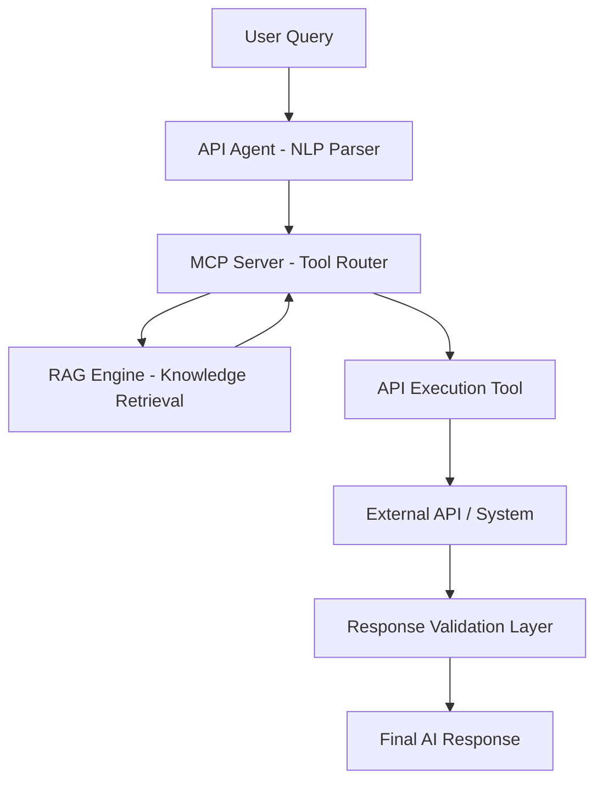
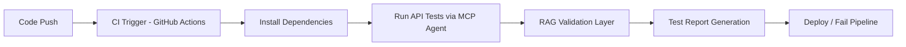

# 🚀 MCP RAG Agent – AI-Powered API Testing Framework


---

## 📌 Overview

The **MCP RAG Agent** is an AI-driven modular testing framework that combines:

* 🔎 **RAG (Retrieval Augmented Generation)** – Knowledge-based context retrieval
* ⚙️ **MCP Layer (Tool Execution Engine)** – Executes tools dynamically
* 🧪 **API Testing Agent** – Automates API validation like Postman

It enables **natural language → API execution → validation → intelligent response generation**.

---

# 🧠 System Architecture



---

## 🧩 Architecture Explanation

### 1️⃣ API Agent Layer

* Accepts natural language input
* Converts request into structured API test case

### 2️⃣ MCP Server Layer

* Central orchestration layer
* Routes requests to appropriate tools

### 3️⃣ RAG Layer

* Fetches contextual knowledge from documents
* Enhances API validation logic

### 4️⃣ Execution Layer

* Executes API calls (GET/POST/PUT/DELETE)
* Captures response payloads

### 5️⃣ Validation Layer

* Compares expected vs actual response
* Returns structured test result

---

# 🔁 End-to-End Flow

```
User Input
   ↓
API Agent (Intent Detection)
   ↓
MCP Server (Tool Selection)
   ↓
RAG (Context Injection)
   ↓
API Execution Engine
   ↓
Response Validation
   ↓
Final Result Output
```

---

# ⚙️ Installation Guide

## 1️⃣ Clone Repository

```bash
git clone https://github.com/karthikeyanramu/MCP_RAG_AGENT.git
cd MCP_RAG_AGENT
```

---

## 2️⃣ Create Virtual Environment

```bash
python -m venv venv
```

Activate:

```bash
# Windows
venv\Scripts\activate

# Mac/Linux
source venv/bin/activate
```

---

## 3️⃣ Install Dependencies

```bash
pip install -r requirements.txt
```

---

## 4️⃣ Start MCP Server

```bash
python server/mcp_server.py
```

Expected:

```
MCP Server running on http://localhost:5000
```

---

## 5️⃣ Run API Agent

```bash
python -m qa_agent.api_agent_runner
```

---

# 🧪 Postman Integration (Manual Testing Support)

Even though this system is AI-driven, it supports Postman-style API testing.

## 📌 Example Request

### 🔹 Endpoint

```
POST http://localhost:5000/execute
```

### 🔹 Headers

```json
{
  "Content-Type": "application/json",
  "Authorization": "Bearer <token-if-needed>"
}
```

### 🔹 Sample Payload

```json
{
  "tool": "api_executor",
  "method": "POST",
  "url": "https://api.example.com/login",
  "headers": {
    "Content-Type": "application/json"
  },
  "body": {
    "username": "test_user",
    "password": "Test@123"
  }
}
```

---

## 📌 Sample Response

```json
{
  "status": 200,
  "message": "Login Successful",
  "token": "eyJhbGciOiJIUzI1NiIs...",
  "validation": "PASSED"
}
```

---

# 🔄 CI/CD Pipeline (QA Maturity Model)

This system can be integrated into CI/CD pipelines for **automated API validation**.

## 🚀 Pipeline Flow



---

## 🧪 CI/CD Benefits

✔ Automated API regression testing
✔ AI-driven validation (reduces manual QA effort)
✔ Early defect detection
✔ Domain knowledge injection via RAG
✔ Scalable test execution

---

## 📌 Sample GitHub Actions Workflow

```yaml
name: MCP API Tests

on: [push]

jobs:
  test:
    runs-on: ubuntu-latest

    steps:
      - uses: actions/checkout@v3

      - name: Setup Python
        uses: actions/setup-python@v4
        with:
          python-version: 3.10

      - name: Install dependencies
        run: pip install -r requirements.txt

      - name: Run MCP API Agent
        run: python -m qa_agent.api_agent_runner
```

---

# 🧰 Available Tools

| Tool             | Purpose                      |
| ---------------- | ---------------------------- |
| knowledge_search | RAG-based document retrieval |
| calculator       | Arithmetic operations        |
| api_executor     | Executes HTTP requests       |

---

# 📊 Real-World Use Cases

* Banking API automation (AML / KYC)
* Collateral management system testing
* Microservices regression testing
* AI-driven QA automation frameworks

---

# ⚠️ Troubleshooting

## ❌ Port conflict

```bash
netstat -ano | findstr :5000
taskkill /PID <pid> /F
```

## ❌ Module error

```bash
pip install -r requirements.txt
```

---

# 🚀 Future Enhancements

* OpenAI / LLM integration
* UI dashboard for test execution
* Kubernetes deployment
* Advanced embedding-based RAG
* Postman collection auto-import

---

# 👨‍💻 Summary

This project demonstrates:

✔ AI-powered API testing
✔ MCP-based tool orchestration
✔ RAG-enhanced validation
✔ Enterprise-grade QA automation architecture

